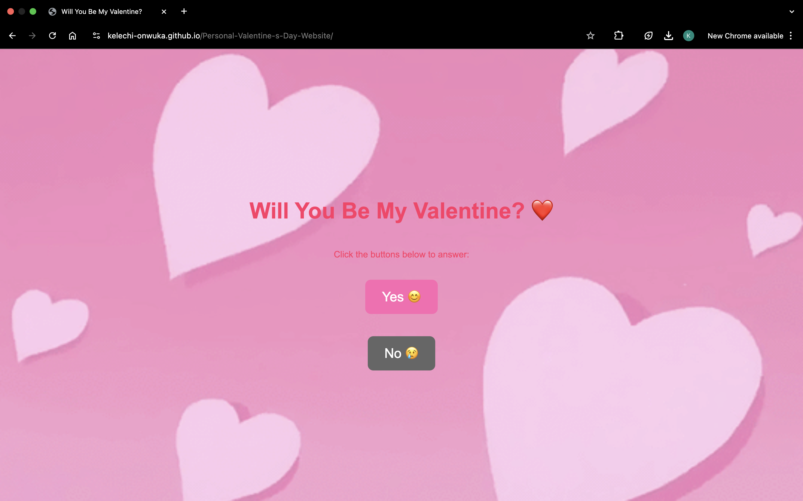

# Personal Valentine's Day Website

A playful interactive website built with HTML, CSS, and JavaScript. Originally created as a creative project for Valentine's Day, it features dynamic interactions—such as a moving Yes/No button and an animated love letter—and is designed to be responsive and accessible.

## Live Site
[https://kelechi-onwuka.github.io/Personal-Valentine-s-Day-Website/](https://kelechi-onwuka.github.io/Personal-Valentine-s-Day-Website/)

## GitHub Repository
[https://github.com/Kelechi-Onwuka/Personal-Valentine-s-Day-Website](https://github.com/Kelechi-Onwuka/Personal-Valentine-s-Day-Website)

## Features
- Interactive Yes/No button with dynamic behavior
- Animated love letter reveal
- Responsive design with themed visuals
- Engaging user interactions using JavaScript

## Built With
- HTML
- CSS
- JavaScript

## Future Updates
- Additional interactive elements and refined animations

## License
MIT License

